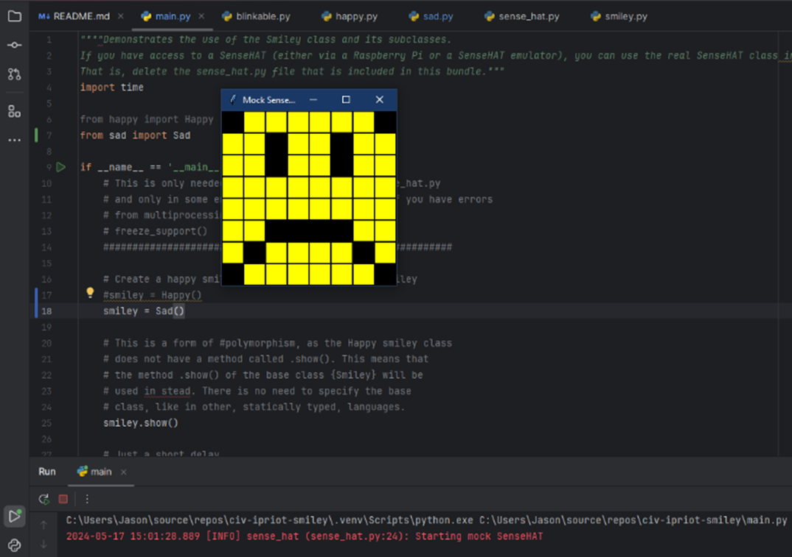

# Evidence and Knowledge

This document provides the structure to evidence your relevant knowledge and skills for this activity.


## Required evidence

### Answer all questions in this document

- Each answer should be complete, well-articulated, and within the specified word count limits (if added) for each question.
- Please make sure all external sources are properly cited.
- You must use your own words. If you use generative AI in any capacity, you must include your full chat transcripts.

### Make all the required modifications to the code

- Please follow the instructions in this document to make the necessary changes to the code.

- When requested to upload evidence, upload all screenshots to `screenshots/` and embed them in this document. For example:

```markdown

```

- You must upload the code into this GitHub repository.
- While you can use a branch, your code should be in main when you submit.
- Upload a zip of this repository to Blackboard when you are ready to submit.
- Feedback will be provided via GitHub, but you will be notified of your result via Blackboard

### Use of Raspberry Pi and SenseHat

The use of Raspberry Pi and SenseHat is optional for this activity. You can use the included ` sense_hat.py` file to simulate the SenseHat on your computer.

If you use a PI, please **delete** the `sense_hat.py` file.

### Accessible version of the code

This project relies on visual patterns that appear on an LED matrix. If you have any accessibility requirements, you can use the `udl/accessible` branch to complete the project. This branch provides an accessible code version that uses text-based patterns instead of visual ones.

Please discuss this with your lecturer before using that branch.

## Specific Tasks & Questions

Address the following tasks and questions based on the code provided in this repository.

### Set up the project locally

1. Clone this repository
2. Run the project locally by executing the `main.py` file
3. Evidence this by providing screenshots of the project directory structure and the output of the `main.py` file


If you are running on a Raspberry Pi, you can use the following command to run the project and then screenshot the result:

```bash
ls
python3 main.py
```

### Identifying and understanding classes

> Note: Ignore the `sense_hat.py` file when answering the questions below

1. List all the classes you identified in the project. Indicate which classes are base classes and which are subclasses. For subclasses, identify all direct base classes. Use the following table for your answers:

| Class Name | Super or Sub?    | Direct parent(s)  |
|------------|------------------|-------------------|
| Smiley     | Super            | -                 |
| SenseHat   | Super            | -                 |
| Blinkable  | Super (Abstract) | -                 |
| Happy      | Sub              | Smiley, Blinkable |
| Sad        | Sub              | Smiley            |


...

2. Explain the concept of 'abstraction' as demonstrated in this project. (Max 150 words)

> An example of abstraction in the project is the Blinkable (ABC). The abstract based class ensures that Blinkable is just a blueprint as well as its blink method; it cannot be instantiated as an abstract class, but its attributes and methods can be passed to another class to inherit and define (such as the Happy class).

3. What is the name of the process of deriving from base classes? What is its purpose in this project? (Max 150 words)

> The name of the process for deriving from base classes is Inheritance. Its purpose in this project is to provide reusability in blocks of code, such as both Sad and Happy inheriting the methods and attributes from Smiley.

### Compare and contrast classes

Compare and contrast the classes Happy and Sad.

1. What is a key difference between the two classes?
   > The key differences are that the placement of pixels in the draw_mouth() methods are different. The Happy subclass also inherits the methods and attributes from the Blinkable ABC (the blink abstract method) while Sad does not.
2. What are the key similarities?
   > Some noticeable commonalities between the Happy and Sad classes are that they both inherit from the Smiley superclass and that they both utilize the draw_mouth() and draw_eyes() methods. The placement of pixels in the draw_eyes() method is also the same (the int values in the eyes list), and they both have the eyes opened initially (wide_open=true).
3. What difference stands out the most to you and why?
   > The fact that the Happy class inherits from the Blinkable ABC but Sad does not; it's almost like a comedic implication that you MUST blink when you are happy, but not necessarily when you are sad.
4. How do these differences affect the functionality of these classes
   > The differences can drastically change the implication and emotion expressed by the smiley (altering the draw_mouth and draw_eyes methods), and it can contain parameters that are required for certain classes/emotions (such as Happy needing blink from ABC).

### Where is the Sense(Hat) in the code?

1. Which class(s) utilize the functionality of the SenseHat?
   > SenseHat can be utilized by the Smiley class and the Sad and Happy classes (as Smiley is a superclass of both).
2. Which of these classes directly interact with the SenseHat functionalities?
   > The Smiley class directly interacts with the SenseHat functionalities.
3. Discuss the hiding of the SenseHAT in terms of encapsulation (100-200 Words)
   > The functionality of SenseHat is hidden and cannot be modified externally from outside its class. It can be accessed by the Smiley class (and subclasses) since it is importing the code from sense_hat; this is how the dim_display and show methods work in the Smiley class. Only the utilization of sense_hat is displayed and the actual finer details of the implementation are hidden in the sense_hat Class. The sense_hat class contains a vast amount of intricate methods and attributes which are not necessary knowledge for the user or to utilize the basic smiley program; in hiding this information the code becomes cleaner and easier to read and understand.

### Sad Smileys Can’t Blink (Or Can They?)

Unlike the `Happy` smiley, the current implementation of the `Sad` smiley does not possess the ability to blink. Let's first explore how blinking has been implemented in the Happy smiley by examining the blink() method, which takes one argument that determines the duration of the blink.

1. **Understanding Blink Mechanism:** In your own words, explain how the `blink()` method enables the Happy smiley to blink. What role does the argument play in this method?

> In the Smiley class which Happy is a subclass of, the RGB values of YELLOW (255, 255, 0) and BLANK (0, 0, 0) are set. The face is a combination of YELLOW and BLANK pixels set in a grid pattern. In the Happy subclass, the draw_eyes(self, wide_open=True) method sets specific pixels (the four pixels being the eyes) in the grid to BLANK using a list (eyes = [10, 13, 18, 21]) as long as wide_open is True and to YELLOW if is False. 
The blink() method sets wide_open to False (which turns the eye pixels to the same colour as the face, YELLOW), produces a delay (using .sleep and the delay argument to determine the amount of time it takes in seconds), and then turns wide_open back to True (which changes the eye pixels back to BLANK); this simulates a face blinking.


2. **Implement Blink in Sad Class:**

   - Create a new method called `blink` within the Sad class. Ensure you use the same method signature as in the Happy class:

   ```python
   def blink(self, delay=0.25):
        self.draw_eyes(wide_open=False)
        self.show()
        time.sleep(delay)
        self.draw_eyes(wide_open=True)
        self.show()
   ```

3. **Code Implementation:** Implement the code that allows the Sad smiley to blink. Use the implementation from the Happy smiley as a reference. Ensure your new method functions similarly by controlling the blink duration through the `delay` argument.

4. **Testing the Implementation:**

- Test the new blink functionality on your Raspberry Pi or within the Python classes provided. You might need to adjust the `main.py` script to incorporate the Sad Smiley's new blinking capability.

Include a screenshot of the sad smiley or the modified `main.py`:



- Observe and document the Sad smiley as it blinks its eyes. Describe any adjustments or issues encountered during implementation.

  > In order for time.sleep(delay) in the blink method to work, I had to import the time module to the Sad class.
  > Then in main, I had to import sad and change smiley = Happy() (in this case i just commented it out) to instead run smiley = Sad() in order to implement the sad smiley.

  ### If It Walks Like a Duck…

  Previously, you implemented the blink functionality for the Sad smiley without utilizing the class `Blinkable`. Assuming you did not use `Blinkable` (even if you actually did), consider how the Sad smiley could blink in a similar manner to the Happy smiley without this specific class.

  1. **Class Type Analysis:** What kind of class is `Blinkable`? Inspect its superclass for clues about its classification.

     > Blinkable is an ABC; an Abstract Based Class.

  2. **Class Implementation:** `Blinkable` is a class intended to be implemented by other classes. What generic term describes this kind of class, which is designed for implementation by others? **Clue**: Notice the lack of any concrete implementation and the naming convention.

  > A good word to describe this class might be template or blueprint; while it cannot be instantiated, its attributes and methods can be adjusted by classes that inherit from it.

  3. **OO Principle Identification:** Referring to your answer in question (2), which Object-Oriented (OO) principle does this represent? Choose from the following and justify your answer in 1-2 sentences: Abstraction, Polymorphism, Inheritance, Encapsulation.

  > The utilization of an abstract class and method to contain relevant characteristics for a subclass is an example of Abstraction.

  4. **Implementation Flexibility:** Explain why you were able to grant the Sad Smiley a blinking feature similar to the Happy Smiley's implementation, even without directly using `Blinkable`.

  > In the Happy subclass, it inherited the blueprint for the methods and attributes of the Blinkable ABC; essentially, the Happy class NEEDED to have a blink method because of the abstract method inherited from the Blinkable ABC. The Sad subclass did not inherit from the Blinkable ABC, which means that while I did include a blink method to make it blink, it was not necessary for it to run; I could have changed the functionality or omitted it altogether.
  > Additionally, Blinkable cannot be instantiated (ABC) and does not have a usable method for blinking; this was defined in the subclass under the blink method.

  5. **Concept and Language Specificity:** In relation to your response to question (4), what is this capability known as, and why is it feasible in Python and many other dynamically typed languages but not in most statically typed programming languages like C#? **Clue** This concept is hinted at in the title of this section.

  > Having multiple variations of the blink method which can function differently but are called the same thing would be an example of polymorphism. This works in Python and other dynamic programming languages because of duck typing; where the attributes and methods (walks like a duck and quacks?) are more prioritised than its type (it’s probably a duck).

  ***

  ## Refactoring

  ### Does a Smiley Have to Be Yellow?

  While our current implementation predominantly features yellow smileys, emotional expressions like sickness or anger typically utilize colors like green, red, or orange. We'll explore the feasibility of integrating these colors into our smileys.

  1. **Defined Colors and Their Location:**

     1. Which colors are defined and in which class(s)?
        > In the Smiley class, WHITE (255, 255, 255), GREEN (0, 255, 0), RED (255, 0, 0), YELLOW (255, 255, 0) and BLANK (0, 0, 0) are defined using RGB colour codes.

     2. What type of variables hold these colors? Are the values expected to change during the program's execution? Explain your answer.
        > They are all tuples which consist of 3 int values for the RGB colour. From the current code's functionality, the values are not expected to change as they correlate to a specific RGB colour. When the eyes blink, the values of the variable do not change (e.g. YELLOW being 255, 255, 0); the pixel just changes to another variable with a predefined RGB colour value (e.g. BLANK being 0, 0, 0).

     3. Add the color blue to the appropriate class using the appropriate format and values.

  2. **Usage of Color Variables:**

     1. In which classes are the color variables used?
        > To be specific, in the program only YELLOW and BLANK are currently used for the colours of the pixels in the grid in the Smiley class. Additionally, they are used during the draw_eyes and draw_mouth methods in the Sad/Happy subclasses to change the colours of the pixels to simulate open/closed eyes and sad/happy mouths.

  3. **Simple Method to Change Colors:**
  4. What is the easiest way you can think to change the smileys to green? Easiest, not necessarily the best!
     > Simply changing Y=self.YELLOW to Y=self.GREEN in the Smiley class would be a simple but naïve way to change the colour. This would not change the colour of the eyes in their blinking state; it would also need to be changed in the draw_eyes method.

  Here's a revised version of the "Flexible Colors – Step 1" section for the smiley project, incorporating your specifications for formatting and content updates:

  ### Flexible Colors – Step 1

  Changing the color of the smileys once is straightforward, but it isn't very flexible. To facilitate various colors for smileys, it is advisable not to hardcode values in any class. This approach was identified earlier as a necessary change. Let's start by removing the built-in assumptions about color in our classes.

  1. **Add a method called `complexion` to the `Smiley` class:** Implement this instance method to return `self.YELLOW`. Using the term "complexion" instead of "color" provides a more abstract terminology that focuses on the meaning rather than implementation.

  2. **Refactor subclasses to use the `complexion` method:** Modify any subclass that directly accesses the color variable to instead utilize the new `complexion` method. This ensures that color handling is centralized and can be easily modified in the future.

  3. **Determine the applicable Object-Oriented principle:** Consider whether Abstraction, Polymorphism, Inheritance, or Encapsulation best applies to the modifications made in this step.

  4. **Verify the implementation:** Ensure that the modifications function as expected. The smileys should still display in yellow, confirming that the new method correctly replaces the direct color references.

  This step is crucial for setting up a more flexible system for color management in the smiley display logic, allowing for easy adjustments and extensions in the future.

  ### Flexible Colors – Step 2

  Having removed the hardcoded color values, we now enhance the base class to support dynamic color assignments more effectively.

  1. **Modify the `__init__()` method in the `Smiley` class:** Introduce a default argument named `complexion` and assign `YELLOW` as its default value. This allows the instantiation of smileys with customizable colors.

  2. **Introduce a new instance variable:** Create a variable called `my_complexion` and assign the `complexion` parameter to it. This step ensures that each smiley instance can maintain its own color state.

  3. **Rationale for `my_complexion`:** Using a distinct instance variable like `my_complexion` avoids potential conflicts with the method parameter names and clarifies that it is an attribute specific to the object.

  4. **Bulk rename:** We want to update our grid to use the value of complexion, but we have so many `Y`'s in the grid. Use your IDE's refactor tool to rename all instances of the **symbol** `Y` to `X`. Where `X` is the value of the `complexion` variable. Include a screenshot evidencing you have found the correct refactor tool and the changes made.

  

  5. **Update the `complexion` method:** Adjust this method to return `self.my_complexion`, ensuring that whatever color is assigned during instantiation is what the smiley displays.

  6. **Verification:** Run the updated code to confirm that Smileys still defaults to yellow unless specified otherwise.

  ### Flexible Colors – Step 3

  With the foundational changes in place, it's now possible to implement varied smiley colors for different emotional expressions.

  1. **Adjust the `Sad` class initialization:** In the `Sad` class's initializer method, change the superclass call to include the `complexion` argument with the value `self.BLUE`, as shown:

     ```python
     super().__init__(complexion=self.BLUE)
     ```

  2. **Test color functionality for the Sad smiley:** Execute the program to verify that the Sad smiley now appears blue.

  3. **Ensure the Happy smiley remains yellow:** Confirm that changes to the Sad smiley do not affect the default color of the Happy smiley, which should still display in yellow.

  4. **Design and Implement An Angry Smiley:** Create an Angry smiley class that inherits from the `Smiley` class. Set the color of the Angry smiley to red by passing `self.RED` as the `complexion` argument in the superclass call.

  ***
